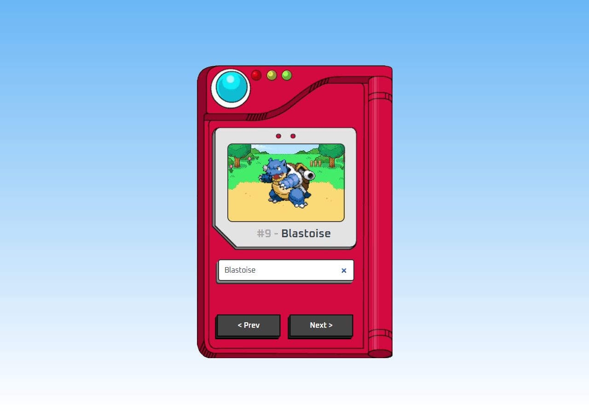

# 🎮 Pokédex - Explore o Mundo Pokémon! 🌍

Bem-vindo ao repositório da **Pokédex**! Aqui você encontrará uma aplicação web interativa que utiliza **HTML**, **CSS**, **JavaScript** e a **PokeAPI** para trazer informações detalhadas sobre seus Pokémon favoritos. 🚀

  
*(Imagem de preview do projeto)*

---

## 🌟 Funcionalidades

- 🔍 **Busca de Pokémon**: Pesquise qualquer Pokémon pelo nome ou número.
- 📄 **Detalhes Completos**: Veja informações como tipo, habilidades, estatísticas e muito mais.
- 🎨 **Design Responsivo**: Funciona perfeitamente em dispositivos móveis e desktops.
- ⚡ **Integração com PokeAPI**: Dados atualizados diretamente da API oficial.

---

## 🛠️ Tecnologias Utilizadas

- **Frontend**:
  - 
  - 
  - 
- **API**:
  - 

---

## 🚀 Como Executar o Projeto

Siga os passos abaixo para rodar a Pokédex localmente:

1. **Clone o repositório**:
   ```bash
   git clone https://github.com/mateus-henriquee/pokedexPokemon.git

2. **Acesse a pasta do projeto:**
```bash
cd pokedexPokemon
```

3. **Abra o arquivo index.html:**
```bash
code .
```

### Explore a Pokédex! 🎉

## 📂 Estrutura do Projeto
```
pokedexPokemon/
├── css          # Pasta CSS
|   └── style.css           # Estilos CSS para a interface
|
├── favicons           # Pasta com favicon
|   └── favicon-16x16.png
|
├── images           # Pasta com imagens
|   ├── pokedex.png
|   └── preview.png
|
├── README.md           # Aquivo README
└── index.html         # Página HTML
```


## 📌 Contribuição
Contribuições são sempre bem-vindas! Se você quiser melhorar este projeto, siga os passos abaixo:

- Faça um fork do repositório.

- Crie uma branch para sua feature (git checkout -b feature/nova-feature).

- Faça o commit das suas alterações (git commit -m 'Adiciona nova feature').

- Faça o push para a branch (git push origin feature/nova-feature).

- Abra um Pull Request.

## 🙌 Créditos
Mateus Henrique - Desenvolvedor do projeto.
GitHub
LinkedIn

### PokeAPI - Fornecimento dos dados Pokémon.
PokeAPI

---
Feito com ❤️ por Mateus Henrique! 🚀
